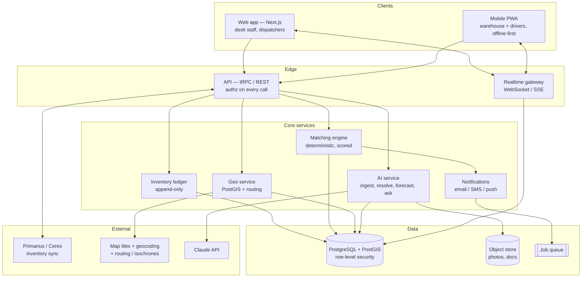

# FoodLink → production: what a real food-bank network app looks like

A plan for turning the demo into something a real food bank would run on Monday morning.
Two pillars stay the same — **inventory management** and **network rebalancing (surplus ↔ shortage)** —
but almost every layer underneath has to change.

---

## Part 1 — Honest audit of what exists today

Walked the whole app locally (`npm run dev`, port 3000). Here's the real state.

| Feature | Works? | What it actually does | Production verdict |
|---|---|---|---|
| Login | ✅ | One hardcoded pair (`admin`/`admin123`), then **assigns you a random food bank** | Throw away |
| Inventory table | ✅ | List, add, edit, delete. Expiry chips go red when past date | Keep the UX, rebuild the model |
| AI ingest (`/api/ingest`) | ⚠️ | Claude + `json_schema` output, accepts text **and images**, then a human review table before save | **The best thing in the app.** Keep and harden |
| Inventory chat (`/api/inventory/chat`) | ⚠️ | Claude writes raw SQL, runs it via `$queryRawUnsafe` | Right idea, dangerous mechanism — redesign |
| Network board | ✅ | Flags (SURPLUS/SHORTAGE), radius slider, type filter, text search | Keep, add the map |
| Request + chat thread | ✅ | Auto-drafted opener, polled every ~3s | Keep, make it real-time |
| Complete transfer | ✅ | Decrements giver, increments receiver, closes flag | Correct idea, fragile matching |
| Map | ❌ | Doesn't exist. Distance is a Haversine number on a card | **Build it** |

⚠️ = code path is correct but currently returns 500: the Anthropic key in `.env.local` has no
credit. The client does surface the failure, but as a raw dump of the provider's JSON error —
readable to us, alarming to a food bank manager. Worth mapping to human sentences.

### Concrete weak points found in the code

1. **`lib/auth.ts`** — auth is the string `"ok"` in an unsigned cookie. Anyone can set it.
2. **`app/login/page.tsx:19-23`** — the food bank you "are" is picked at random on login. Cute for a
   demo, meaningless as a product.
3. **`app/api/inventory/chat/route.ts:8-23`** — the read-only guard is a regex blocklist over
   model-generated SQL, then `$queryRawUnsafe`. The tenant filter (`foodBankId = '...'`) is only a
   *prompt instruction*. Nothing in code enforces it. One creative query and you're reading another
   food bank's stock. This is the single biggest correctness/security issue in the codebase.
4. **`app/api/requests/[id]/complete/route.ts:49-73`** — transfers match items by
   `name.toLowerCase() === itemName.toLowerCase()` plus exact unit string. "Canned corn" ≠
   "Corn, canned" ≠ "canned corn (14oz)". In practice this silently no-ops on the giver's side and
   invents a new row on the receiver's.
5. **Quantity is mutated in place** — `quantity: remaining`. No history, no way to answer "where did
   those 200 lbs go", no way to reverse a mistake.
6. **`prisma/schema.prisma`** — lat/lng are `Float @default(0)`, addresses are free text, and there's
   no geocoding step. Coordinates are hand-typed in the seed file.
7. **`/api/flags` returns every open flag in the network**, then filters by distance in the browser.
   Fine at 5 banks. Not fine at 500.
8. **SQLite, single file** — no concurrency story, no PostGIS.

---

## Part 2 — What a real food bank actually needs

This is where most "food bank app" designs go wrong, so it's worth being specific. The demo models a
food bank as *a list of items*. In reality:

- **Pounds are the currency.** Food banks report in pounds to Feeding America, to funders, to the
  USDA. Every item needs a defensible pound-equivalent, which means case weights and unit
  conversions are core data, not a formatting concern.
- **A food bank is not one building.** It's a warehouse (often several, plus freezer/cooler zones)
  distributing to a *partner network* of 100–400 pantries, shelters, and meal programs. The app's
  "food bank ↔ food bank" model is only the top tier.
- **Not all food is transferable.** USDA/TEFAP commodities have allocation rules. Donor agreements
  can restrict resale or transfer. Recalled lots must be quarantined instantly and traced to whoever
  received them.
- **Cold chain is a hard constraint.** Frozen/refrigerated/dry are different logistics problems.
  A match that ignores temperature zone is not a match.
- **"Expiry" is nuanced.** Most dates on shelf-stable food are *best-by*, not safety dates, and food
  banks distribute past them under written policy. The current red "expired" chip would make staff
  distrust the tool immediately.
- **They already have systems.** Primarius (PWW) and Ceres for warehouse inventory, Link2Feed or
  Oasis for client intake, MealConnect for retail rescue. A new tool that doesn't read from those is
  a second system staff must double-enter into — which is how it dies.
- **The users are on phones, in a warehouse, wearing gloves.** Not at a desk.

**Strategic consequence:** don't rebuild the warehouse system of record. Be the **network layer** —
the thing that sees across food banks, spots the imbalance, and moves the food. Sync inventory in
from whatever they already run; own the matching, the map, the negotiation, and the transfer record.

---

## Part 3 — Target architecture



### Stack

| Layer | Choice | Why |
|---|---|---|
| Web | Next.js (keep) | Already there, server components suit this |
| Mobile | PWA first, React Native later | Warehouse staff need camera + offline; PWA gets 80% |
| DB | **PostgreSQL + PostGIS** | Geospatial queries, row-level security, real concurrency |
| ORM | Prisma (keep) + raw SQL for geo | PostGIS needs raw queries; Prisma is fine elsewhere |
| Auth | Auth.js or WorkOS | Real orgs, roles, SSO for the big banks |
| Realtime | Postgres `LISTEN/NOTIFY` → SSE, or Supabase Realtime | Kills the 3-second polling |
| Queue | BullMQ / Redis or Postgres-backed | Notifications, geocoding, sync jobs, forecasts |
| Files | S3/R2 + signed URLs | Delivery photos, signed manifests, donation notes |
| Map | **MapLibre GL JS** + Protomaps/OpenFreeMap tiles | Open, no vendor lock, no per-load billing |
| Geocode + routing | Mapbox (or Google Routes) | Isochrones + real drive times; only paid piece |
| AI | Claude (keep) | Extraction and reasoning; see Part 7 for the boundaries |

---

## Part 4 — The real data model

The central change: **inventory is a ledger, not a number.**

```
Organization        food bank, partner pantry, or donor. type + parent for network hierarchy
Site                a physical location: warehouse, cooler, pantry. has geography(Point), dock hours,
                    capabilities [frozen|cooler|dry], vehicle access
User                real person, real password hash / SSO identity
Membership          user × organization × role  (admin | inventory | dispatcher | driver | viewer)

Product             the shared catalog. canonical name, category, GTIN/UPC, allergens,
                    temperature_zone, default_case_weight_lbs, is_usda_commodity
UnitConversion      product × unit → pounds. the thing that makes reporting possible

Lot                 a receipt of one product: quantity, unit, lbs_equivalent, best_by, received_at,
                    donor, restriction (none|usda_tefap|donor_restricted), status (available|held|recalled)
StockEntry          APPEND-ONLY ledger line. lot × site × delta_qty × reason
                    (receipt | distribution | transfer_out | transfer_in | adjustment | spoilage)
                    × actor × timestamp × source_document
                    → on-hand is always SUM(delta_qty). Never UPDATE a quantity.

Listing             replaces Flag. surplus or need. product (catalog-resolved) + free text fallback,
                    quantity, window (available_from/until), temperature_zone, transport
                    (pickup_only | can_deliver | need_delivery), status, visibility scope
Match               a proposed pairing: listing × counterparty_org × score × reasons[] × state
                    (suggested | requested | accepted | declined | expired)
Transfer            the agreed movement. match × quantity × lbs × scheduled_at × state machine
TransferEvent       append-only: proposed → accepted → scheduled → picked_up → delivered → confirmed
                    (or cancelled/disputed). each with actor, timestamp, optional photo + signature
Trip / Vehicle      optional logistics: multi-stop runs, capacity, temperature capability
Thread / Message    negotiation, attached to a Match — keep the demo's chat, it's good
Notification        per-user, per-channel, with delivery receipts
AuditLog            who did what to which record, immutable
```

**Why the ledger matters:** it's the difference between "we think we have 300 lbs of rice" and "here
are the 6 events that produced 300 lbs of rice, and here's who to call about the recall on lot #4."
It also makes the transfer bug in Part 1 structurally impossible — a transfer writes two ledger
lines, it doesn't mutate two rows and hope the names matched.

**Tenancy:** Postgres **row-level security** keyed to the caller's org, so a leak like the text-to-SQL
one can't happen even if application code is wrong. This is the load-bearing fix.

---

## Part 5 — The map (the part you specifically asked about)

The map shouldn't be a decorative panel next to the list. It should be **the primary interface for
the network view** — the list becomes the secondary representation of whatever the map is showing.

### 5.1 Stack

- **MapLibre GL JS** — open-source, vector tiles, no per-load license. Renders 1000s of pins smoothly.
- **Tiles:** Protomaps (self-host a single `.pmtiles` file — genuinely $0) or OpenFreeMap. Mapbox if
  you want the polished default styling and will pay for it.
- **Geocoding:** address → lat/lng on org creation, queued and cached. Mapbox Geocoding or
  Google; Nominatim only for dev (usage policy forbids bulk).
- **Spatial queries in PostGIS**, not JavaScript:
  ```sql
  -- listings within 50 miles, nearest first — indexed, scales to thousands
  SELECT l.*, ST_Distance(s.geog, $me::geography) / 1609.34 AS miles
  FROM listing l
  JOIN site s ON s.id = l.site_id
  WHERE l.status = 'open'
    AND ST_DWithin(s.geog, $me::geography, $radius_meters)
  ORDER BY s.geog <-> $me::geography
  LIMIT 200;
  ```
  This replaces "fetch every flag, filter in the browser."
- **Drive time, not crow-flies.** 40 miles across the Bay is a 90-minute drive; 40 miles up I-5 is 40
  minutes. Use a **Mapbox Isochrone** ("everything within 45 min of my dock") as the default filter,
  with straight-line radius as the cheap fallback. This is the single highest-value geo feature —
  it's the difference between a plausible match and a real one.

### 5.2 What's on the map

| Layer | Rendering |
|---|---|
| Your sites | Distinct home marker, always visible |
| Surplus listings | Green pins, radius ∝ pounds available |
| Shortage listings | Amber pins, same scaling |
| Clusters | Numbered bubbles that expand on zoom (MapLibre `cluster: true`) |
| Match lines | Curved arc from giver → receiver when a match is selected or active |
| Isochrone | Translucent drive-time polygon around your site |
| In-transit | Vehicle position along the route for active transfers |
| Heatmap (toggle) | Category density — "where is all the protein in this region" |

### 5.3 Interactions

- **Hover a pin** → compact tooltip (item, qty, org, drive time).
- **Click a pin** → side drawer with the full listing, photos, and a primary action
  (*Request* / *Offer*), without leaving the map.
- **Map ↔ list are bound.** Panning filters the list to the viewport; hovering a list row highlights
  its pin. One selection model, two views.
- **Draw-a-region** for dispatchers: lasso an area, see every open listing inside it.
- **"Plan a run"** — select several listings, the app orders them into a route with a total drive
  time and hands the driver turn-by-turn navigation.
- **Live** — new listings drop onto the map in real time, briefly pulsing.
- **Mobile** — map is the default screen; bottom sheet instead of side drawer.

### 5.4 Data you need to make it real

Geocoded sites (not hand-typed coordinates), dock hours + access notes per site, temperature
capability per site, and a service-area polygon per organization. That last one matters: food banks
have **assigned territories** and generally don't poach outside them — the map should respect that,
not just draw circles.

---

## Part 6 — The matching engine

The demo waits for a human to scroll a board and spot a match. The product should propose them.

Deterministic and explainable — not an LLM decision:

```
score(surplus, need) =
    0.30 × product_match        exact catalog match > same subcategory > fuzzy name
  + 0.25 × logistics_fit        drive time, dock hours overlap, who can deliver
  + 0.20 × urgency              days until best-by on the surplus side
  + 0.15 × need_severity        how far below par-level the receiving bank is
  + 0.10 × relationship         prior successful transfers between the two orgs

hard filters (never surface a match that fails these):
  - temperature zone compatible
  - receiver can physically accept the volume (pallet/space capacity)
  - no USDA/donor restriction blocking the transfer
  - lot not recalled or on hold
  - within service area / agreed sharing policy
```

Output a ranked **"Suggested matches"** queue with a plain-English reason on each card:
*"Berkeley needs protein, you have 200 cans of tuna expiring in 40 days, 22 min drive, they've
picked up from you 4 times."* Human still clicks approve — that's the trust model, and it's the same
one the demo's ingest review table already gets right.

Add **par levels** per org per category so "shortage" can be detected automatically instead of
waiting for someone to post a flag. That's the shift from a bulletin board to a system.

---

## Part 7 — Where AI genuinely earns its place

Keep it to jobs where language is the problem. Everything else is deterministic code.

**1. Ingest — keep, this is the crown jewel.**
The photo/email/CSV → structured rows flow is real, daily pain removed. Harden it:
- Resolve every extracted item against the **product catalog** (embedding search over canonical
  names + GTIN lookup), so "canned corn" and "Corn, Canned 14oz" become the same product.
- Return confidence per field; only auto-accept high confidence, always route the rest to the review
  table that already exists.
- Support PDFs and multi-page scans, and accept a photo of a **pallet label / BOL**.
- Feed corrections back — the corrections users make in the review table are training signal for
  catalog aliases.

**2. Ask-your-inventory — same feature, safe mechanism.**
Replace model-authored SQL with **typed tools** over a parameterized query layer:
`get_inventory(category?, expiring_before?, site?)`, `get_totals(group_by)`,
`find_listings(radius_min, category)`. The model chooses the tool and the arguments; **your code
writes the SQL and injects the org filter.** Same conversational UX, cross-tenant leak becomes
structurally impossible. This is a rewrite of `app/api/inventory/chat/route.ts`, and it's worth doing
before anyone else sees the app.

**3. Listing drafting.** "Post what's about to expire" → drafts the listings, human approves.

**4. Demand forecasting.** Seasonality + historical distribution + partner-agency counts → predicted
shortage 2–3 weeks out. Statistical model does the math; the LLM writes the explanation.

**5. Donor email triage.** Watch a shared inbox, extract offers, draft replies. Never auto-send.

**Explicitly not AI:** the matching decision, compliance/restriction checks, quantity math,
who-gets-what allocation. Those must be auditable and identical every run.

---

## Part 8 — Interactivity & real-time

- Replace the 3s poll on the message thread with **SSE or WebSocket**, fed by Postgres
  `LISTEN/NOTIFY`. Typing indicators, read receipts, presence.
- **Live map updates** — listings appear/disappear without refresh.
- **Optimistic UI** on every action, with rollback.
- **Notifications that actually reach people**: push for "someone requested your surplus", SMS for
  time-critical rescue (produce expiring today), a digest email for the rest. Per-user, per-channel
  preferences. Food bank staff do not sit watching a dashboard.
- **Offline-first mobile** — record a pickup in a freezer with no signal, sync when it reconnects.
  Ledger-based inventory makes this tractable (append events, reconcile on sync).

---

## Part 9 — Security, privacy, compliance

| Concern | Requirement |
|---|---|
| Auth | Real users, hashed passwords or SSO, MFA for admins, sessions in DB |
| Tenancy | Postgres row-level security — enforced in the database, not in prompts |
| Roles | admin / inventory / dispatcher / driver / viewer, least privilege |
| Audit | Immutable log of every inventory and transfer action |
| PII | Contact details are currently public on every board card — gate them behind an accepted match |
| Food safety | Recall workflow: quarantine a lot, trace every downstream recipient, notify |
| Reporting | Pound-based exports for Feeding America / USDA / funder reporting |
| Liability | Bill Emerson Good Samaritan Act protections — record donor, condition, chain of custody |
| Backups | PITR, tested restores. This becomes a system of record |

---

## Part 10 — Roadmap

**Phase 0 — Make the demo defensible (1–2 weeks).**
Real auth + orgs + roles. Postgres + PostGIS. Kill `$queryRawUnsafe`, ship the tool-based chat.
Surface API errors in the UI. Fix the API key. → *A demo that survives a technical question.*

**Phase 1 — The map release (3–4 weeks).**
Geocoding pipeline, PostGIS proximity queries, MapLibre network map with clustering + drawer,
map↔list binding, drive-time isochrone filter. → *The thing you were asked for, and the best demo.*

**Phase 2 — Real inventory (4–6 weeks).**
Product catalog + unit conversions + pounds. Ledger model. Lots, best-by vs expiry done correctly,
temperature zones. CSV import + a Primarius/Ceres read-only sync for one design partner.
→ *Numbers a food bank would actually trust.*

**Phase 3 — Matching + logistics (4–6 weeks).**
Par levels, scored suggested matches with reasons, transfer state machine with photo/signature
proof, multi-stop route planning, notifications. → *Stops being a board, starts being a system.*

**Phase 4 — Network intelligence (ongoing).**
Forecasting, regional dashboards, pounds-moved and food-miles-saved impact reporting, partner-agency
tier, open API. → *The thing a Feeding America affiliate pays for.*

**Pilot strategy:** two or three neighbouring food banks in one region, not one bank alone. The whole
value is the network — a single-bank pilot can only ever demo half the product. Measure: pounds
rebalanced, pounds diverted from landfill, median time from listing → agreed transfer, staff hours
saved on data entry.

---

## Part 11 — What I'd do next, concretely

**Status:** items 1, 2 and 4 below are done — see the "map + safe AI queries" commit.
Items 3 and 5 are the next pieces of work.

Ranked by value per hour of work:

1. **Fix the swallowed API errors** and put a real key in. One hour. Right now the flagship feature
   fails silently, which reads as "broken app" to anyone trying it.
2. **Rewrite the chat route to typed tools.** Half a day. Removes the worst risk in the codebase and
   loses nothing.
3. **Postgres + PostGIS + geocoding.** One day. Unblocks everything spatial.
4. **Ship the map.** Two to three days for a genuinely impressive clustered, filterable,
   drawer-on-click network map. Biggest visible payoff in the whole plan.
5. **Product catalog + pounds.** The unglamorous one that makes the rest credible.

Items 1–4 are roughly a week and would take this from a convincing hackathon demo to something you
could put in front of an actual food bank operations director without flinching.
